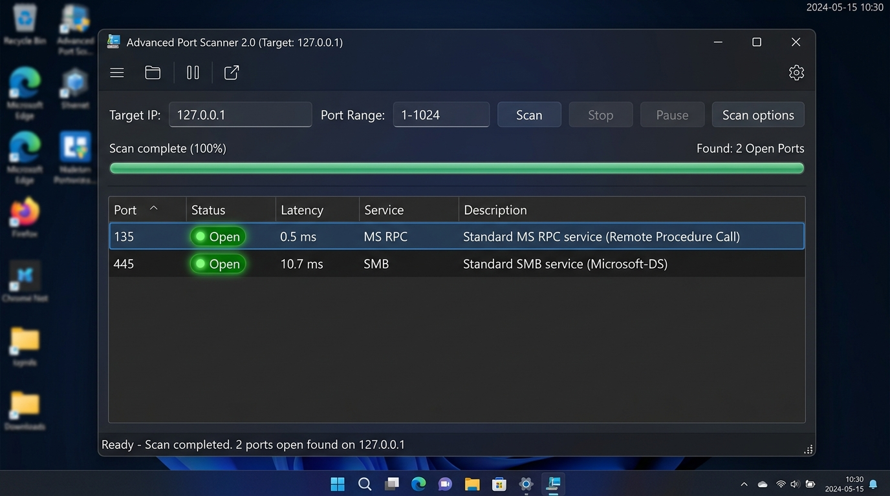
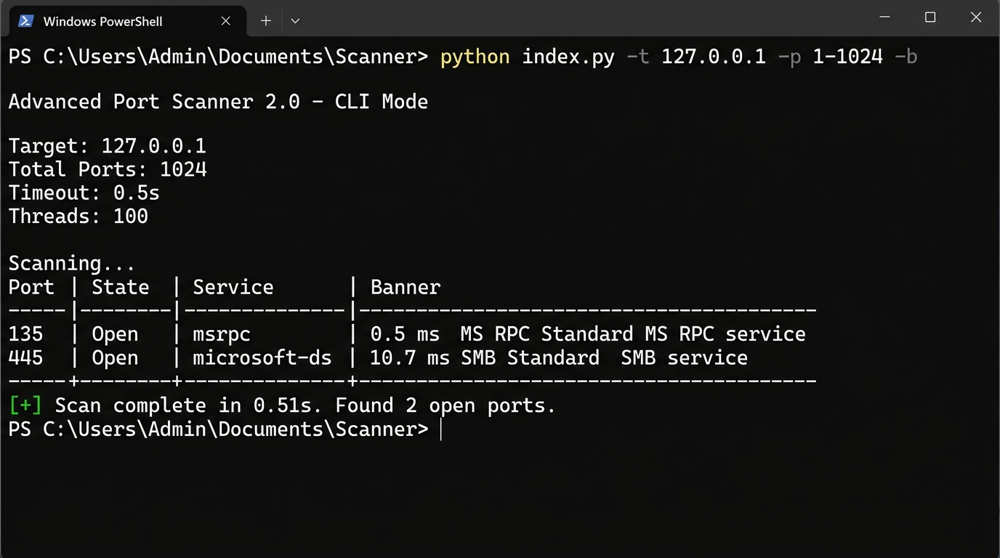

# 🔍 Advanced Port Scanner 2.0

A high-performance, multi-threaded network scanner script featuring a modern dark Tkinter GUI, terminal CLI support, response latency tracking, service banner detection, and an easy one-click Windows `run.bat` launcher menu.


---

## 📸 Scan Results & Application Output

### 🎨 Graphical User Interface (GUI) Scan Results
The application features a sleek dark UI with real-time progress indicators, response latency metrics, colored status badges, and service detection.



### 🖥️ Command-Line Interface (CLI) Scan Results
Terminal output displaying target specifications, connection latency (ms), identified services, and summary results.



---

## ⚡ Easy One-Click Execution (`run.bat`)

Double-click **`run.bat`** on Windows to launch the interactive control menu:

```cmd
run.bat
```

### Interactive Menu Options:
- **[1] Launch Modern Dark GUI**: Opens the desktop graphical interface.
- **[2] Quick Terminal Scan**: Scans localhost (`127.0.0.1: 1-1024`) with banner grabbing directly in terminal.
- **[3] Custom Terminal Scan**: Prompts for target IP/domain and port range, then runs scan.

---

## 📖 Direct Command Execution

You can also run the scripts directly via Python:

### 1. Launch Graphical User Interface (GUI)
```bash
python port_scanner.py
# or
python index.py
```

### 2. Command Line Scans (CLI)
```bash
# Scan common ports on local machine
python index.py -t 127.0.0.1 -p 1-1024

# Banner grabbing enabled with JSON export
python index.py -t scanme.nmap.org -p 22,80,443 -b -o scan_results.json

# High-speed scan with custom threads & timeout
python index.py -t 192.168.1.1 -p 80-90,8080 --timeout 0.3 --threads 150
```

#### CLI Command Options:
| Flag | Short | Description | Default |
|------|-------|-------------|---------|
| `--target` | `-t` | Target IP address or domain name | `127.0.0.1` |
| `--ports` | `-p` | Ports range or comma-separated list | `1-1024` |
| `--timeout` | | Connection timeout in seconds | `0.5` |
| `--threads` | | Concurrent thread worker count | `100` |
| `--banner` | `-b` | Enable service banner grabbing | `False` |
| `--output` | `-o` | Export output file path (`.json`, `.csv`, `.txt`) | `None` |
| `--gui` | | Force launch Graphical GUI | `False` |

---

## ✨ Core Features

- **🚀 High-Speed Multi-Threading**: Parallel socket connections across up to 500 concurrent threads.
- **🌐 Domain Resolution**: Resolves domain names (`localhost`, `scanme.nmap.org`) and IPv4 targets.
- **⚡ Latency Tracking (RTT)**: Displays round-trip connection latency in milliseconds.
- **🛡️ Banner Grabbing**: Probe open ports for HTTP headers, SSH string signatures, and service greetings.
- **🔍 Real-Time Filter**: Filter open ports by port, service name, or banner content.
- **📋 Context Menu**: Right-click to copy `Target:Port` or banner string to clipboard.
- **💾 Multi-Format Export**: Export scan results to **JSON**, **CSV**, or **TXT** files.

---

## 📂 Project Structure

```
Port-Scanning/
├── run.bat                     # Easy one-click launcher menu
├── index.py                    # Main script entry point (CLI & GUI)
├── port_scanner.py             # Port scanner core engine & Tkinter GUI
├── README.md                   # Complete documentation
└── assets/                     # Scan result screenshots & visual assets
    ├── gui_scan_results.jpg    # GUI Scan Results screenshot
    └── cli_scan_results.jpg    # CLI Scan Results screenshot
```

---

## 📄 License

This project is open-source and licensed under the [MIT License](LICENSE).
